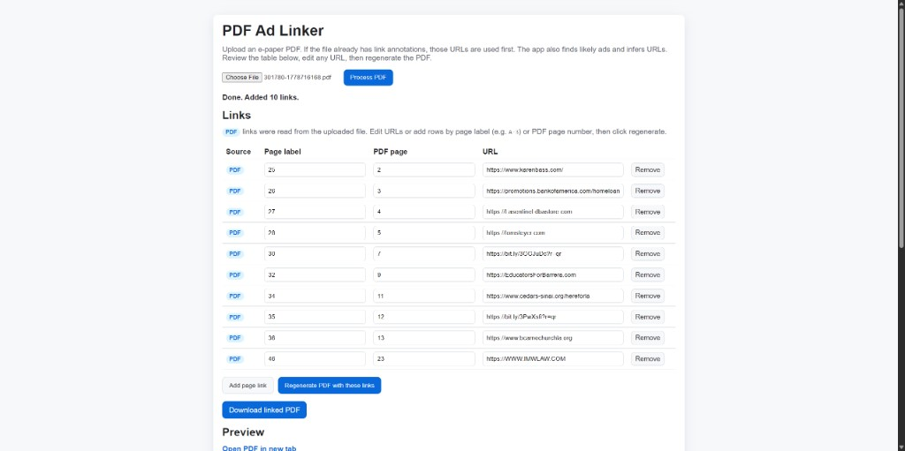

# PDF Ad Linker

Upload an e-paper PDF and produce a version with clickable link annotations over ad regions. The app reads URLs that are already embedded in the file, detects additional ads automatically, lets you review and edit every link in a table, and regenerates the PDF with your final URLs.



## How it works (end to end)

### 1. Upload and process

1. Open the web UI and choose a PDF.
2. Click **Process PDF**. The file is sent to `POST /process` as multipart form data.
3. The server opens the PDF with PyMuPDF, builds a list of **link candidates** (page, rectangle, URL, source), applies configuration and any saved defaults, writes new URI link annotations, and returns:
   - A JSON list of links (page number, optional section label, URL, source, preview text)
   - The linked PDF as base64 for preview and download

Processing always starts from the **original uploaded file** you selected, not from a previously downloaded result. Keep that same file selected when you regenerate.

### 2. Review links in the table

After processing, the **Links** table shows one row per annotation that will be written:

| Column | Meaning |
|--------|---------|
| **Source** | Where the URL came from (see below) |
| **Page label** | Newspaper-style label when detected (e.g. `A-3`), or blank |
| **PDF page** | 1-based page index in the PDF file |
| **URL** | Destination; editable before regenerate |

**Source badges**

- **PDF** — Read from an existing URI link annotation in the uploaded file.
- **Detected** — Inferred by the ad-detection pipeline (text, QR, OCR, brand map).
- **Manual** — Added from your table or from a page-level override with no overlapping detection.

You can edit any URL, change page label or PDF page, remove rows, or use **Add page link** for a page that was missed.

### 3. Regenerate with your edits

1. Adjust URLs (and page label / PDF page as needed).
2. Click **Regenerate PDF with these links**.
3. The same original PDF is processed again with an `overrides` JSON payload. Overrides are matched by **page label** or **PDF page number** first (stable across runs). Link IDs from an earlier run are only used when a row has no page information.
4. Existing URI links in the file are cleared and replaced with the final set so annotations do not stack or duplicate.

Reachability checks are relaxed for PDF-sourced links, configured defaults, and user overrides so long campaign URLs are not dropped.

### 4. Download or preview

Use **Download linked PDF** or the embedded preview. The download filename is prefixed with `linked_`.

---

## URL resolution order

When building the final URL for each ad region, precedence is:

1. **Your overrides** (regenerate table) — by page label or PDF page; wins over everything else on that page.
2. **Existing PDF links** — URI annotations already in the file; used before auto-detection on overlapping regions.
3. **`page_link_defaults.json`** — Fixed URLs for specific PDF pages or section labels (skipped on pages that already have a PDF link).
4. **Auto-detection** — Text blocks, image/QR/OCR pipeline, and `brand_domains.json`.

Overlapping candidates are deduplicated; higher-confidence sources (existing PDF links score highest) are kept when two regions conflict.

---

## Backend pipeline (detailed)

All logic lives in `api/index.py`.

### A. Read existing PDF links

For each page, `page.get_links()` collects URI annotations. Each becomes a candidate with source `pdf`, the annotation rectangle, and the normalized URL. Blocklisted or implausible URLs are skipped.

### B. Detect ad candidates

Two paths are merged:

**Text-based ads** (`find_ad_candidates`)

- Skips page 1, classified/legal-notice pages, and most editorial pages (with an exception for large bottom-panel ads on editorial spreads).
- Scans text blocks for ad/CTA keywords plus a plausible URL.

**Image-based ads** (`extract_image_ads_with_ocr`)

- **Religious grid pages**: bottom panel split into a 4×3 grid; each cell is OCR’d.
- **Other pages**: large images are scanned for QR codes (`zxing-cpp`, multiple scales/tiles), nearby text URLs, then full OCR (`rapidocr-onnxruntime`).
- QR regions can be expanded to cover the full ad panel.
- Brand names without a visible URL can map via `brand_domains.json`.

Candidates are deduplicated when rectangles overlap on the same page.

### C. Page labels

Section labels such as `A-3` come from the PDF page label metadata when present, otherwise from header text on the page. Labels are shown in the UI and used for overrides and defaults.

### D. Apply defaults and overrides

- **`page_link_defaults.json`** — `pages` (PDF page number → URL) and `page_labels` (label → URL).
- **Regenerate overrides** — JSON array of `{ "url", "page"?, "page_label"?, "link_id"? }`.

### E. Validate and write

- Auto-detected URLs are checked for reachability (HEAD request, with trusted-domain shortcuts); PDF, default, and override URLs skip this step.
- All existing URI links on each page are removed, then new links are inserted for the final candidate list.
- The modified PDF is returned to the client.

---

## Configuration files

### `brand_domains.json`

Maps brand or organization text (from OCR or page text) to a destination URL when no explicit URL is found:

```json
{
  "tom steyer": "https://tomsteyer.com",
  "bank of america": "https://bofa.com/HomeTeam"
}
```

Built-in defaults in code are merged with this file. Fuzzy spelling matches are attempted for OCR noise.

### `page_link_defaults.json`

Applies known URLs for recurring placements without using the UI each time:

```json
{
  "pages": {
    "5": "https://tomsteyer.com"
  },
  "page_labels": {
    "A-5": "https://tomsteyer.com"
  }
}
```

Defaults do not override pages that already have a link in the uploaded PDF.

---

## Local run

1. Create and activate a virtualenv.
2. Install dependencies:

   ```bash
   pip install -r requirements.txt
   ```

3. Start the dev server:

   ```bash
   python api/index.py
   ```

4. Open http://127.0.0.1:5000

## Detection quality notes

- Ad detection is heuristic (block size, ad/CTA keywords, URL patterns, image area).
- Classified and legal/public-notice pages are skipped.
- Religious-page bottom grids use a dedicated 4×3 slot scan.
- QR decoding uses multiple image variants, scales, and tiles for small codes.
- OCR and brand mapping are best-effort; use the review table and regenerate for corrections.
- Obvious bad hosts (e.g. truncated `er.com`, generic email domains, blocklisted sites) are filtered from auto-detection.
- Auto-detected URLs that fail reachability are omitted unless you set them manually or via defaults/overrides.

## Project layout

| Path | Role |
|------|------|
| `api/index.py` | Flask app, detection, linking, `/process` API |
| `templates/index.html` | Upload UI, link table, regenerate |
| `static/style.css` | UI styles |
| `brand_domains.json` | Brand → URL mapping |
| `page_link_defaults.json` | Default URLs by page or section label |
| `requirements.txt` | Python dependencies |
| `docs/screenshot.png` | README screenshot of the web UI |
